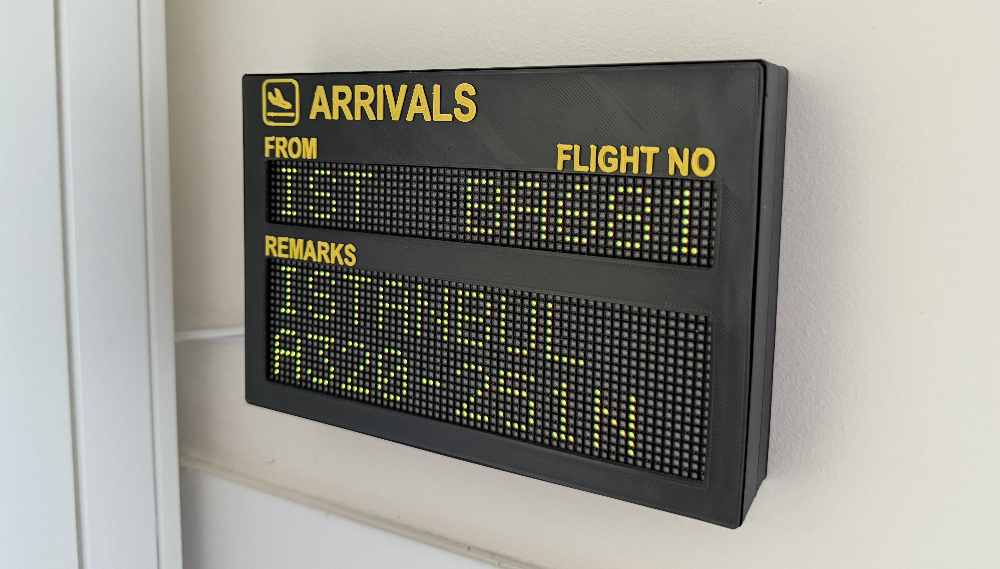

# ✈️ Overhead Flight Tracker with Raspberry Pi

<!--- Start of badges -->
<!-- Badges: python,raspberrypi,api,3d_printing,electronics,fusion360 -->

<!--- End of badges -->

<!--- Blurb
Ever wondered where the planes passing overhead are coming from? This Raspberry Pi project fetches live flight data and renders it on a dot‑matrix panel. A 3D‑printed enclosure brings it all together, mimicking a classic airport arrivals board.
-->

<!--- Start of Thumbnail-->
<!--- src="Images/thumbnail.jpg" -->
<!--- End of Thumbnail-->

<div style="text-align:center;">
    
</div>


### Table of Contents

**[✨ Features](#-features) <br> 
[📋 Prerequisites](#-prerequisites) <br>
[🔌 Raspberry Pi Setup](#-raspberry-pi-setup) <br>
[🔧 Hardware Assembly and Wiring](#-hardware-assembly-and-wiring) <br>
[💻 Software Installation](#-software-installation) <br>
[🙏 Credits & Inspiration](#-credits--inspiration)**

<br>

## ✨ Features

- **Live Flight Data:** Fetches real-time data from the [FlightRadarAPI](https://pypi.org/project/FlightRadarAPI/) for aircraft within a configurable radius.

- **Configurable Location & Search Radius:** Set your home coordinates and choose how far to scan the skies around you. You can also set a maximum altitude if only tracking landing flights on final approach.

- **Dot-Matrix Panel:** Displays flight data on an LED matrix panel using a [5x7 dot-matrix font](fonts/dot_matrix_font.py) (with automatic scrolling for long city names) to mimic the classic arrivals board look.

- **Dynamic Status Colour:** The text display colour changes on a green-to-red gradient based on how early or delayed the flight is.

- **Custom 3D-Printed Case:** A purpose-designed enclosure houses the Pi and display panel, creating a compact, standalone arrivals board.

- **Multi-processing Architecture:** The display logic is non-blocking, running in a separate process to prevent stutter. This allows the main script to fetch new flight data at any time without interrupting smooth text animations on the matrix display.

## 📋 Prerequisites

Here is the hardware, tools, and material you will need to build your own flight board:

- **Raspberry Pi:** For example, a [Pi Zero WH](https://thepihut.com/products/raspberry-pi-zero-wh-with-pre-soldered-header?variant=547332849681&country=GB&currency=GBP&utm_medium=product_sync&utm_source=google&utm_content=sag_organic&utm_campaign=sag_organic&gad_source=1&gad_campaignid=11284298573&gbraid=0AAAAADfQ4GGELxyUDK-MXwh7vph4BEDCa&gclid=Cj0KCQjw1JjDBhDjARIsABlM2SsFhuRp0j_vZ-WN3Cg39v57Ki52kaFcM2Zpd7_jJAu70MgbLrW5hQMaAmodEALw_wcB).

- **Micro SD card:** For installing the Raspberry Pi OS.

- **Internet Connection:** For the Raspberry Pi to access the FlightRadar24 API.

- **[Waveshare 64x32 LED Matrix Panel](https://thepihut.com/products/rgb-full-colour-led-matrix-panel-2-5mm-pitch-64x32-pixels)** 

- **5V 4A power supply**: A separate, high-amperage power supply to power the matrix panel. Do not attempt to power the matrix directly from the Pi's 5V GPIO pin, as this may damage your Pi.

- **Access to a 3D printer:** STL files for the custom enclosure, designed to resemble an airport arrivals board, are provided within this repository.

- **Magnets (12x [5mmx2mm magnets](https://www.amazon.co.uk/dp/B09H2W3TQZ?ref=ppx_pop_mob_ap_share)):** These are used to create a snap-fit closure for the enclosure.

- **Superglue:** For securing the magnets into their slots in the 3D-printed parts.

- **Soldering equipment:** Primarily used for heat-staking the Raspberry Pi to the case's mounting posts (i.e., melting the plastic posts to secure the board).

## 🔌 Raspberry Pi Setup

These steps prepare your Raspberry Pi's operating system for the project.

### 1. Flash Raspberry Pi OS

- Download the [Raspberry Pi Imager](https://www.raspberrypi.com/software/) for your computer
- Use the Imager to flash Raspberry Pi OS onto your Micro SD card with the following OS customisation settings:
  - **Enable SSH** with password authentication (under the 'Services' tab). This is essential for connecting to your Pi remotely.
  - **Set a username, password and hostname.** Make a note of these; you'll need them for SSH access.
  - **Configure wireless LAN.** Add your SSID (Wi-Fi network name) and password.
  - **Set up the locale settings** with the `Europe/London` timezone.
- Insert the prepared SD card into your Raspberry Pi.

### 2. Connect to your Raspberry Pi

- The Raspberry Pi receives its power through its Micro USB Power port. Connect a standard 5V power supply to this port.

- From your computer's terminal, connect to your Pi via SSH:

    ```
    ssh <your_username>@<your_hostname>.local
    # Use the username, password and hostname you set in the Imager.
    ```

### 3. Disable On-board Audio

The RGB matrix library requires exclusive use of certain hardware resources that conflict with the Raspberry Pi's onboard audio output. You must disable it:

- Edit the config file: 
    ```
    sudo nano /boot/firmware/config.txt
    ```

- Change `dtparam=audio=on` to `dtparam=audio=off`.

- Save and exit the file, then reboot your Raspberry Pi (`sudo reboot`).

## 🔧 Hardware Assembly and Wiring


## 💻 Software Installation

These steps cover obtaining the project code, installing software dependencies, and configuring the application to run automatically on your Raspberry Pi.

### 1. Install System Dependencies:
First, ensure your Raspberry Pi system is up-to-date and install essential packages needed for Python development and interacting with the hardware. These are necessary for both the rpi-rgb-led-matrix library and potentially some Python packages.
```
sudo apt-get update
sudo apt install -y git python3-dev python3-pip python3-venv python3-distutils
```

### 2. Install the `rpi-rgb-led-matrix` Library:

This library is required to control the RGB LED Matrix panel. You need to clone it and build the Python bindings.


```
cd ~
git clone https://github.com/hzeller/rpi-rgb-led-matrix.git
cd rpi-rgb-led-matrix
make build-python
sudo make install-python
```

*(Note: If you encounter issues during the build-python step, refer to the official [rpi-rgb-led-matrix documentation](https://github.com/hzeller/rpi-rgb-led-matrix/tree/master/bindings/python) for troubleshooting.)*

### 3. Clone the Flight-Display Repository:

Navigate back to your home directory (or your preferred projects folder) and clone your flight-tracker code from GitHub.

```
cd ~
git clone https://github.com/isi22/Flight-Display
cd Flight-Display
```

### 4. Create a python virtual environment:
Using a virtual environment is best practice for managing project dependencies.

```
python3 -m venv .venv
source .venv/bin/activate
```

### 5. Install Python Dependencies:
```
pip install -r requirements.txt
```

### 6. Configure the project settings:

Update the `config.py` file with your project-specific configurations. This is where you define your XXX.

- Open the file:
    ```
    nano src/config.py
    ```

- Once `nano` opens, you will see the contents of `config.py`. Use the arrow keys to move the cursor up, down, left, and right. Type directly to make your changes.

- Save and Exit (`Ctrl + X`).

### 7. Set up the main script as a systemd service:

To make your flight tracker run automatically when the Raspberry Pi boots up, create a systemd service file.

- Create a systemd service file:
    ```
    sudo nano /etc/systemd/system/flight-display.service
    ```

- Add the following content to the file. Replace `<your_username>` and `<your_api_key>` with your actual username and API credentials. The TfL API Key (referred to as primary key) can be found in your [Profile](https://api-portal.tfl.gov.uk/profile) in the TfL API portal after registering and subscribing to the `500 Requests per min` product.

    ```
    [Unit]
    Description=Overhead Flight Display
    After=network.target

    [Service]
    User=root
    WorkingDirectory=/home/<your_username>/Flight-Display
    ExecStart=/home/<your_username>/Flight-Display/.venv/bin/python /home/<your_username>/Flight-Display/main.py
    Restart=on-failure
    StandardOutput=journal
    StandardError=journal

    [Install]
    WantedBy=multi-user.target
    ```

- Save and exit (Ctrl+O, Enter, Ctrl+X in nano).

- Reload systemd, enable, and start the service:

    ```
    sudo systemctl daemon-reload
    sudo systemctl enable flight-display.service
    sudo systemctl start flight-display.service
    ```

- Check the service status and logs:

    ```
    sudo systemctl status flight-display.service
    journalctl -u flight-display.service -f # For live service logs
    ```
    *(Press Ctrl+C to stop viewing the logs.)*

- Your flight tracker should now be running and updating the LED matrix display automatically.

## 🙏 Credits & Inspiration

This project draws inspiration and direct resources from the following:

- **Dot Matrix Typeface:** The authentic visual style is achieved using [Daniel Hart's](https://github.com/DanielHartUK/Dot-Matrix-Typeface) excellent Dot Matrix Typeface.

- **Core Code & Logic:** Both [Chris Crocker-White's](https://github.com/chrisys/train-departure-display) UK National Rail Departure Display and [Sean Petykowski's](https://github.com/petykowski/London-TFL-Arrivals-Board) London TfL Arrivals Board served as direct inspiration and a foundational basis for the Python code and API interaction logic implemented in this project.

- **Hardware Design, Assembly & 3D Printed Parts:**
[Chris Crocker-White's](https://github.com/chrisys/train-departure-display) comprehensive documentation for his UK National Rail Departure Display was particularly instrumental for the hardware design, assembly techniques (such as heat-staking the Raspberry Pi into the case), and provided significant inspiration for the custom 3D-printed enclosure parts. His detailed wiring guide for the display was also followed.


